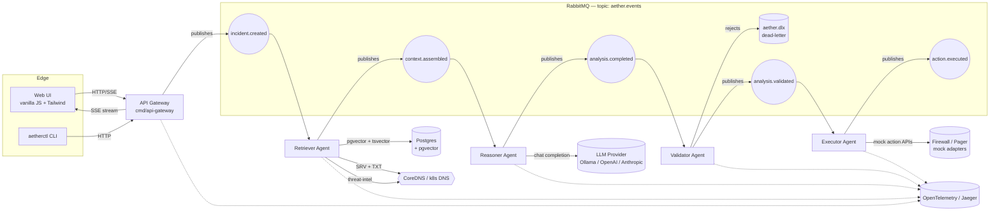
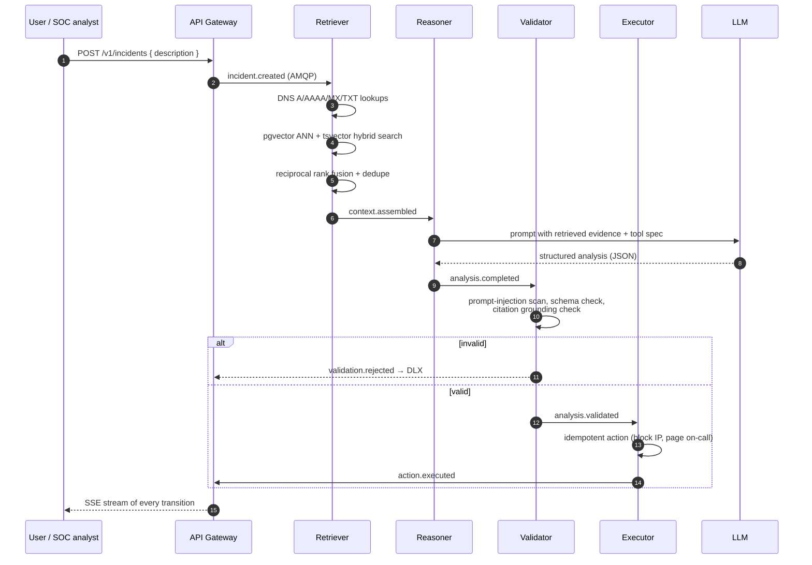

<div align="center">

# AetherFlow

**An event-driven, multi-agent platform for intelligent incident response.**

RabbitMQ choreography · agentic RAG over pgvector · DNS-aware service discovery · OpenTelemetry end-to-end · BYO-LLM (Ollama by default, OpenAI / Anthropic / any OpenAI-compatible endpoint via UI)

[Quickstart](#quickstart) · [Architecture](#architecture) · [Demo workflow](#demo-the-suspicious-domain-incident) · [Security model](#security-model) · [Benchmarks](docs/benchmarks.md) · [ADRs](docs/adr)

</div>

---

## Why AetherFlow

Most "AI agent" repos are a single Python notebook chained to OpenAI. AetherFlow is built like a piece of production infrastructure:

- **Event-driven, not RPC-spaghetti.** Agents never call each other directly. Everything moves over a RabbitMQ topic exchange with durable queues, per-stage dead-letter routing, idempotency keys, and bounded retries. You can kill any agent mid-flow and the saga resumes.
- **Agentic RAG, not naive RAG.** The Retriever decides *whether* and *how* to search. It blends dense pgvector ANN with sparse `tsvector` BM25-style scoring (hybrid search), then reranks with reciprocal rank fusion. It can also perform live DNS lookups and threat-intel resolution as just another tool.
- **DNS-native service discovery.** Services find each other via SRV records (local CoreDNS in dev, Kubernetes headless services in prod). No hardcoded hostnames, no Consul bolt-on.
- **Adversarial-aware.** A dedicated Validator agent screens every reasoner output for prompt-injection markers, jailbreak heuristics, schema drift, and citation hallucinations before any Executor action runs.
- **Observability first.** Every event, LLM call, DB query, and DNS lookup is a span in a single OpenTelemetry trace. Jaeger ships in the compose file.
- **BYO-LLM.** Ollama runs locally out of the box. The web UI has a key drawer where any reviewer can paste an OpenAI / Anthropic / OpenAI-compatible endpoint and re-run the same incident with a hosted model — no rebuild, no env file edit.

## Architecture



### Agent loop, in plain English



### Why each piece is non-trivial

| Concern | What AetherFlow does | Why it matters |
| --- | --- | --- |
| Reliability | Per-stage dead-letter exchange with `x-death` tracking; bounded retries; idempotency-key dedup table | Lets you crash any agent and replay safely |
| Throughput | Per-agent prefetch tuning; consumer pools; backpressure via QoS | A single Reasoner shouldn't drown when the LLM stalls |
| Hybrid RAG | pgvector (cosine) + Postgres `ts_rank_cd` → reciprocal rank fusion → optional cross-encoder rerank slot | Dense alone is great for semantics, terrible for exact identifiers (CVE-2024-…, IP literals). Hybrid is the production answer |
| Service discovery | Each service registers via DNS SRV; clients resolve `_amqp._tcp.aether.local` etc. | Drop a new replica into the cluster and the bus client picks it up without config |
| LLM portability | `llm.Provider` interface; Ollama, OpenAI, Anthropic, and generic OpenAI-compatible adapters; per-request override via header | Reviewers can swap providers from the UI |
| Security | Prompt-injection lexicon + regex stack, structured-output JSON schema enforcement, mTLS-ready transport, secrets only in env / Vault | The Validator is a real agent, not a vibe |
| Observability | OTel SDK in every binary; trace propagated via AMQP headers; Jaeger UI in compose | One trace shows the full incident from click to firewall mock |

## Quickstart

Prereqs: Docker + Docker Compose, Go 1.22+, ~6 GB free for the Ollama image. No Python, no Node build step.

```bash
git clone https://github.com/zipgod24/aetherflow.git
cd aetherflow
cp .env.example .env

# Bring up RabbitMQ, Postgres+pgvector, Ollama, Jaeger, and all agents
make up

# In a second terminal, seed the RAG corpus (MITRE ATT&CK + sample runbooks)
make seed

# Open the UI
open http://localhost:8080
```

Then click **Run demo incident** in the top right, or:

```bash
./bin/aetherctl incident submit --file examples/incidents/suspicious-domain.json
./bin/aetherctl incident watch <incident-id>
```

The same call works against a hosted LLM — open the **API Keys** drawer in the UI and paste an OpenAI or Anthropic key. No restart needed.

## Demo: the "suspicious domain" incident

Run `make demo`. AetherFlow will:

1. Ingest an incident: *"Endpoint 10.0.4.17 is making periodic DNS queries for `paypa1-secure-login.com`. Is this malicious?"*
2. **Retriever** resolves the domain (A, MX, NS, TXT), pulls WHOIS-style hints from the bundled threat-intel corpus, and runs a hybrid search across MITRE ATT&CK and your runbooks for "domain typosquat C2 beaconing".
3. **Reasoner** asks the LLM for a structured `IncidentAnalysis` JSON (verdict, confidence, IOCs, recommended actions, citation IDs).
4. **Validator** checks the JSON against the schema, verifies every cited document ID was actually in the retrieved set, scans for injection patterns, rejects if any check fails.
5. **Executor** triggers a mock firewall block + pages a mock on-call (both adapters are interfaces — drop in real ones).
6. The UI streams every step over SSE, and a single Jaeger trace at `http://localhost:16686` shows the full waterfall.

## Project layout

```
aetherflow/
├── cmd/                        # one binary per service
│   ├── api-gateway/            # HTTP + SSE + UI host
│   ├── orchestrator/           # saga coordinator (timeouts, compensations)
│   ├── retriever-agent/        # hybrid RAG + DNS tools
│   ├── reasoner-agent/         # LLM call with retrieved evidence
│   ├── validator-agent/        # adversarial + schema validation
│   ├── executor-agent/         # idempotent side effects
│   └── aetherctl/              # CLI
├── internal/
│   ├── bus/                    # RabbitMQ topology, pub/sub, DLX, retries
│   ├── events/                 # versioned event schemas
│   ├── llm/                    # provider interface + adapters
│   ├── rag/                    # chunker, embedder, pgvector store, hybrid retriever
│   ├── agent/                  # agent runtime + base loop
│   ├── dns/                    # SRV discovery + threat-intel resolver
│   ├── security/               # prompt-injection defense, schema enforcement
│   ├── otel/                   # tracing setup
│   ├── sse/                    # server-sent events fan-out
│   └── config/                 # env + UI-provided keys
├── web/ui/                     # static SPA (no build step)
├── deploy/
│   ├── helm/aetherflow/        # Helm chart
│   └── k8s/                    # raw manifests
├── docs/
│   ├── adr/                    # architecture decision records
│   ├── architecture.md
│   ├── benchmarks.md
│   └── threat-model.md
├── examples/                   # sample incidents + RAG corpus
├── scripts/                    # seed, demo, dev utilities
├── docker-compose.yml
└── Makefile
```

## Security model

AetherFlow's threat model lives in [`docs/threat-model.md`](docs/threat-model.md). The short version:

- The Reasoner's LLM output is **never trusted directly.** Every downstream consumer (Validator, Executor) treats it as untrusted user input.
- The Validator runs a layered check: structural (does the JSON match the schema?), grounded (does every citation ID appear in the retrieved evidence set?), adversarial (does the output contain known injection markers — `ignore previous instructions`, base64 walls, role-flip tokens, etc.?), and tool-safety (does any recommended action exceed the configured authority level?).
- Executor actions are idempotent: every action has an `idempotency_key` (incident_id + action_kind + target_hash) and a deduplication table.
- Inter-service AMQP traffic supports mTLS via `RABBITMQ_TLS_*` envs. The provided compose file uses plaintext for local dev.
- User-supplied API keys submitted via the UI are stored encrypted at rest (AES-GCM with a per-deployment master key from `AETHER_MASTER_KEY`) and never logged.

## BYO LLM

```
┌─────────────────────────────────────────────┐
│  AetherFlow                                 │
│  ┌─────────────────────────────────────┐    │
│  │  llm.Provider interface             │    │
│  └─────────────────────────────────────┘    │
│      ▲           ▲           ▲       ▲      │
│   Ollama      OpenAI    Anthropic  Custom   │
│  (default)                       (any       │
│                                  OpenAI-    │
│                                  compatible)│
└─────────────────────────────────────────────┘
```

In the UI's **API Keys** drawer (top right), pick a provider, paste a key, choose a model, hit save. The setting is persisted per-browser in `localStorage` plus mirrored to the gateway via `POST /v1/config/llm`. Subsequent incidents include the override in the AMQP message headers and the Reasoner uses it for that incident only — your Ollama default is untouched.

## Status

This is an **opinionated reference architecture** released as a working MVP. Production deployment requires: real action adapters (the executor's firewall/pager calls are mocks), Helm chart hardening for your environment, key-management integration (HashiCorp Vault or AWS KMS) instead of the bundled AES-GCM, and a sanctioned threat-intel feed for the DNS resolver.

PRs welcome — see [CONTRIBUTING.md](CONTRIBUTING.md).

## License

Apache 2.0. See [LICENSE](LICENSE).
